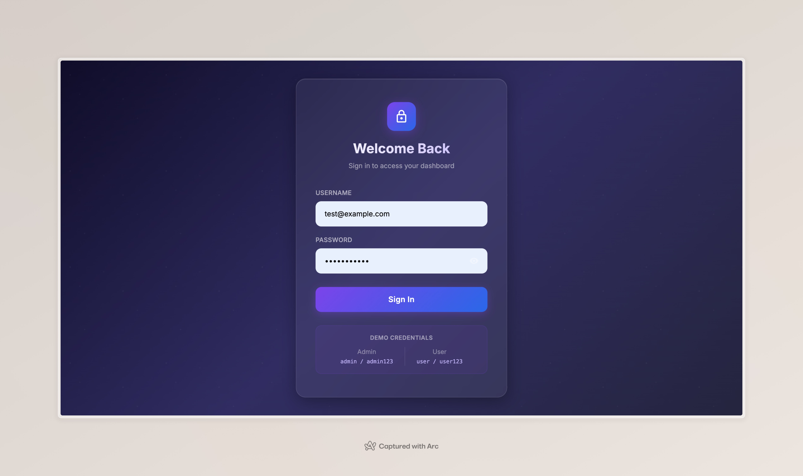
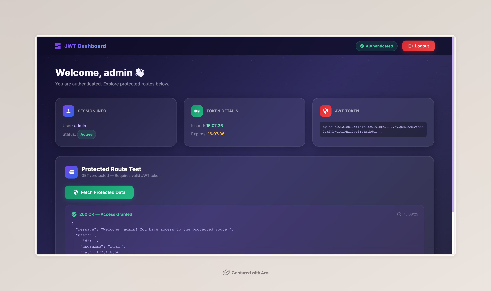

# JWT Authentication & Microservices App 🔐

A comprehensive monorepo implementation of a session-based web application. This project features a React.js frontend that consumes JWT-secured REST APIs provided by an Express.js backend. 

## 🎯 Objective
- Build a frontend UI that consumes JWT APIs.
- Implement session-based authentication (token stored per session).
- Restrict access to pages based on login state.
- Automatically start all microservices locally through simple executable scripts.

## 📸 Screenshots

Below are screenshots demonstrating the UI flows and Session Storage functionality:

### 1. Login Page & DevTools


### 2. Session Token Storage


### 3. Protected Dashboard & Access Granted



## 🧩 Features Implemented
1. **Login Page:** 
   - User enters Username & Password.
   - Calls `POST /login` on the backend.
   - On success, the JWT token is saved locally to `sessionStorage`.
   - Automatically redirects to the Protected Dashboard.
2. **Protected Dashboard Page:** 
   - Strict Route Guards: Read-only access if `JWT` exists. Redirects unauthorised users seamlessly back to login.
   - Calls `GET /protected`.
   - Sends the token securely via the headers: `Authorization: Bearer <token>`
3. **Logout Functionality:** 
   - Clears the active session via `sessionStorage.removeItem("token");`
   - Redirects to the login route.

## 💻 Tech Stack
- **Frontend Framework:** React.js
- **Styling:** Bootstrap 5, Custom CSS (Glassmorphism & Gradients)
- **UI Components:** Material UI (MUI) icons
- **Data Fetching:** Axios
- **Backend API:** Node.js, Express.js
- **Authentication:** jsonwebtoken (JWT)

---

## 📁 Project Structure

```text
/
├── backend/                  # Express.js REST API
│   ├── server.js             # API Logic & JWT Handling
│   └── package.json          # Node dependencies
├── frontend/                 # React UI Application
│   ├── public/
│   ├── src/
│   │   ├── components/
│   │   │   ├── Login.js      # Login Form Component
│   │   │   └── Dashboard.js  # Protected Route Component
│   │   ├── App.js            # React Router integration
│   │   ├── index.js          # React Entry
│   │   └── index.css         # Global Styles & Animations
│   └── package.json          # React dependencies
├── screenshots/              # UI Demo Captures 
├── run_mac_linux.sh          # Start script for macOS/Linux
└── run_windows.bat           # Start script for Windows
```

---

## ⚙️ How to Run Locally

We have provided convenient automation scripts that install dependencies and boot both applications simultaneously!

### On macOS / Linux
Open your terminal in the root of the project and run:
```bash
chmod +x run_mac_linux.sh
./run_mac_linux.sh
```

### On Windows
Double-click the `run_windows.bat` file or execute it via your command prompt:
```cmd
run_windows.bat
```

Once executed:
- **Backend** runs on: `http://localhost:5000`
- **Frontend** runs on: `http://localhost:3000`

---

## 🔑 Test Credentials

The backend comes pre-configured with memory variables for seamless demonstration. Try logging in on the frontend with:

* **Admin User:** `admin` / `admin123`
* **Standard User:** `user` / `user123`
